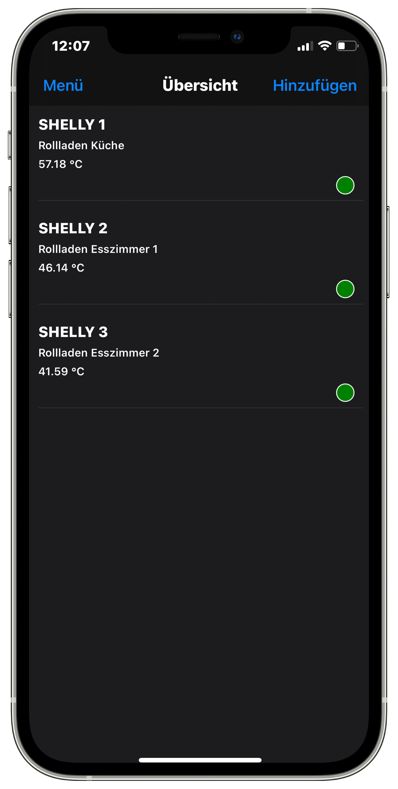
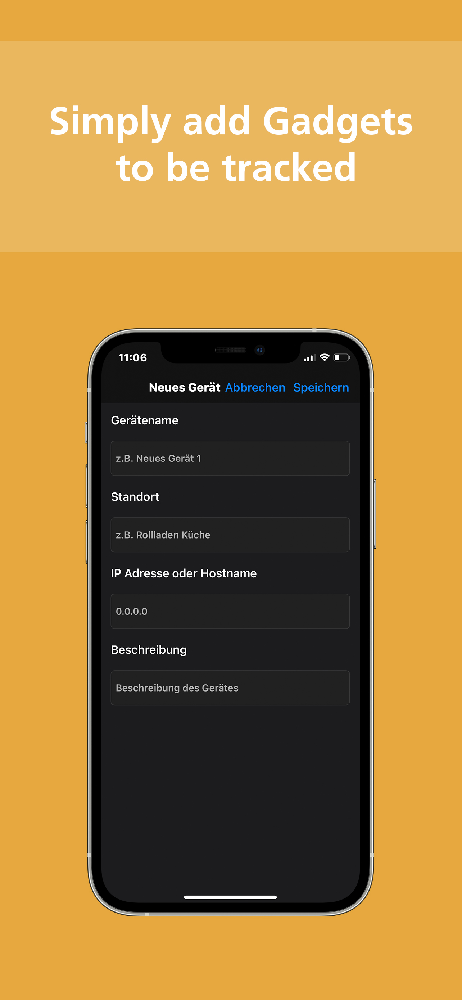
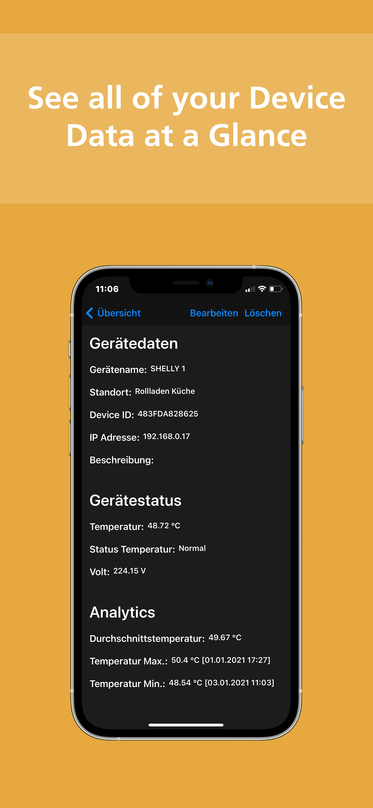

# StatusChecker

## Pipelines

## Technology
 - Xamarin.Forms
 - C#

## Description
Checks the Status-Page of multiple Shelly IoT-Gadgets based on given IpAddresses.
It displays the Temperature of each Gadget and allows re-checking the status.

## Screenshots

&nbsp;&nbsp;&nbsp;&nbsp;&nbsp;&nbsp;
