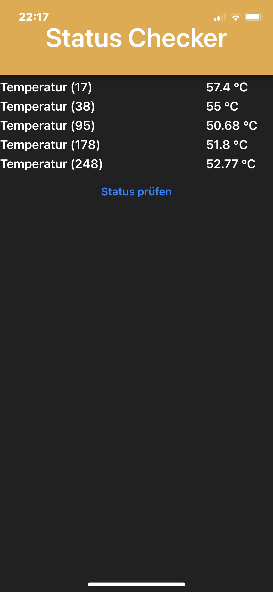

# StatusChecker

## Technology
 - Xamarin.Forms

## Description
Checks the Status-Page of multiple Shelly IoT-Gadgets based on given IpAddresses.
It displays the Temperature of each Gadget and allows re-checking the status.

### How to add Gadgets
In *MainPage.xaml.cs* add the following Dictionary-Items.
These will map the IpAddresses to the Labels for Temperature-Labels

```cs
var gadgetConfigs = new Dictionary<string, Label>()
{
    { "1.0.0.10", _temp_1 },
    { "1.0.0.11", _temp_2 },
    { "1.0.0.12", _temp_3 },
    { "1.0.0.13", _temp_4 },
    { "1.0.0.14", _temp_5 }
};
```

This Configuration via Dictionary will be deprecated soon and then moved to an XML-based Configuration that allows dynamically adding new Gadgets. Next to that the Basic-Authentication will be configurated there too.


## Screenshots

